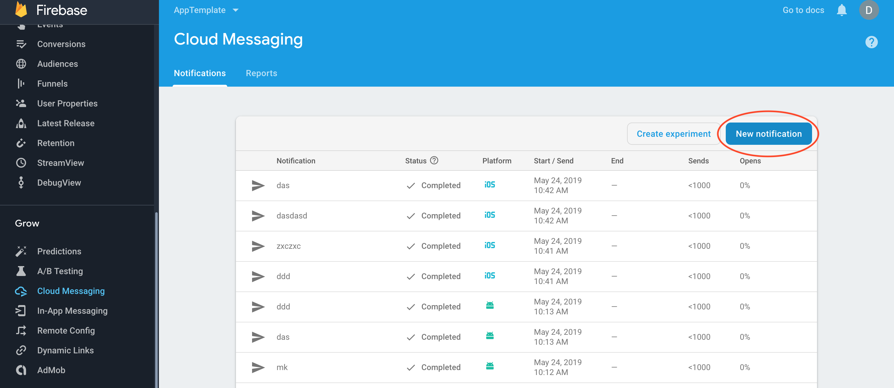
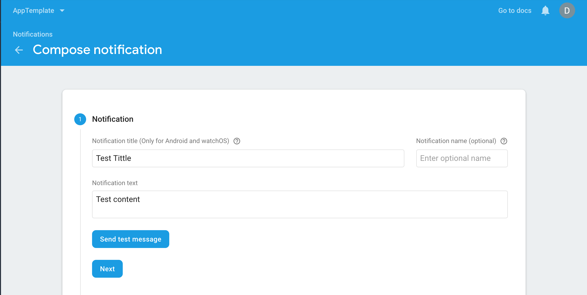
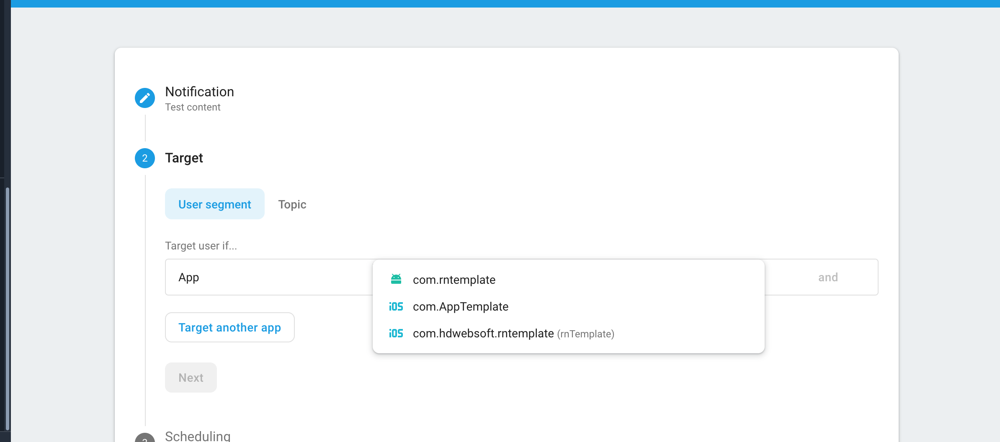

# React Native Notification

React Native Notification work with firebase and redux saga to handle Notificaiton

## SETUP

- Config Firebase
  https://rnfirebase.io/docs/v5.x.x/installation/ios

- Config Cloud Messaging
  https://rnfirebase.io/docs/v5.x.x/messaging/ios

- Config Notifications
  https://rnfirebase.io/docs/v5.x.x/notifications/ios

* Add notification saga to your root saga

```bash
import { all, fork } from 'redux-saga/effects';
import notificationSaga from '../../node_modules/@hd/notification/saga'
export default function* rootSaga() {
  yield all([
    // ... your other sagas here
    fork(notificationSaga)
  ]);
};
```

- Add notification reducer to redux

```bash
import { combineReducers } from 'redux';
import { reducer as reducerNotification } from '../../node_modules/@hd/notification/reducer'

export default combineReducers({
    // ... your other reducers here
    notifications: reducerNotification
});
```

## USAGE

- [Optional](docs/options.md)

## Push notification via firebase step by step:

- Step 1 
- Step 2 
- Step 3 
- Step 4 
