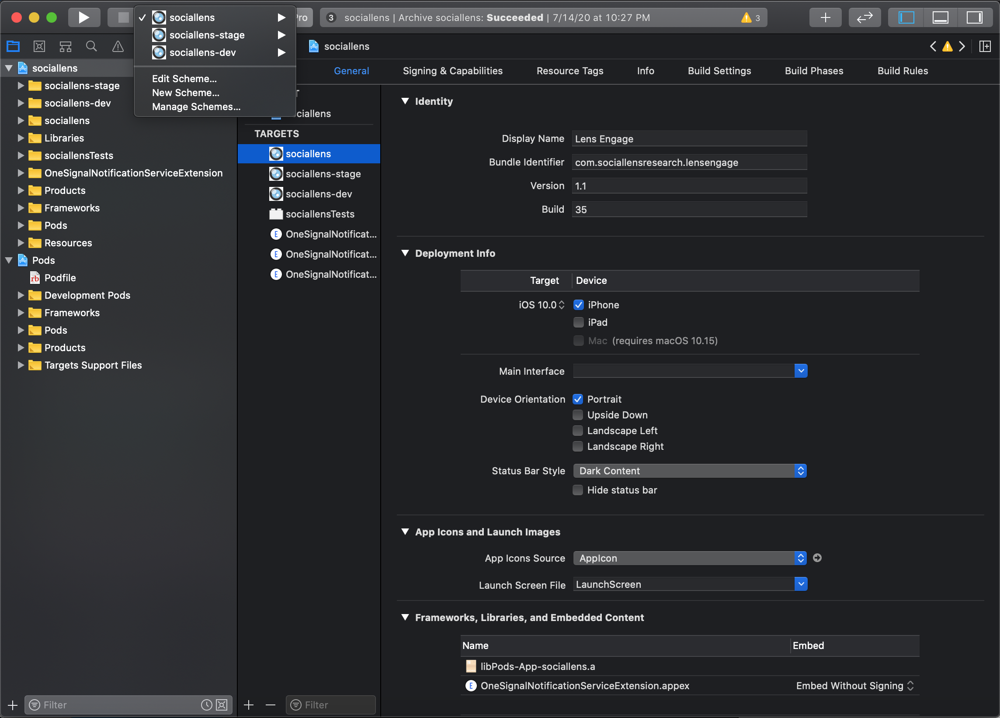
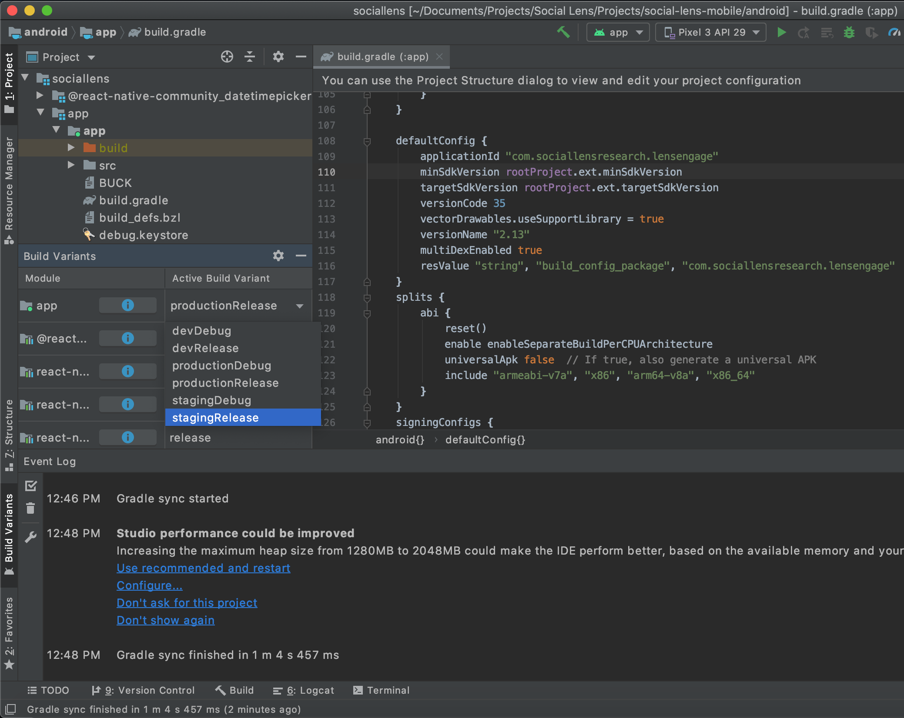

# Social Lens Mobile

## Installation

+ Installing dependencies

    You will need Node, the React Native command line interface, Xcode, a JDK, and Android Studio. ([See more](https://reactnative.dev/docs/environment-setup))
    
	- If you use Mac OS, and you don't have * CocoaPods* latest version:
		```
		sudo gem install cocoapods
		```

	- If you don't have *npx*:
		```
		npm i npx -g
		```

+ Clone project
	```
	git clone git@gitlab.com:goldfish-projects/social-lens-mobile.git
	```

+ Installing project dependencies, from project root folder run:
	```
	npm run setup-all
	```
    
## Run iOS

+ Run the app from XCode:
	- use scheme `sociallens` for production environment
	- use scheme `sociallens-stage` for staging environment


## Run Android

+ Run the app from Android Studio
	- use variant `production...` for production environment
	- use variant `staging...` for staging environment


+ Run the app from command line
	- Production environment
		```
		npm run run-prod
		```
	- Staging environment
		```
		npm run run-staging
		```

+ Build the app from command line
	- Production environment
		```
		npm run build-prod
		```
	- Staging environment
		```
		npm run build-staging
		```

## Environment configuration

+ iOS
	- Production environment: `ios/sociallens`
	- Staging environment: `ios/sociallens-stage`

+ Android
	- Production environment: `.env`
	- Staging environment: `.env.stage`